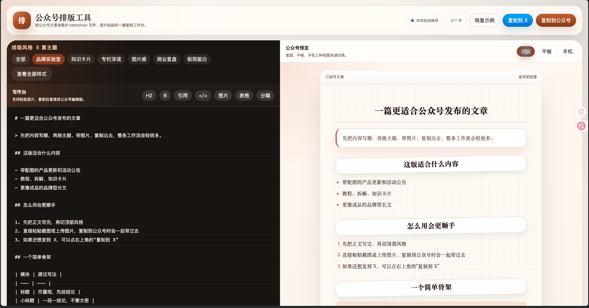
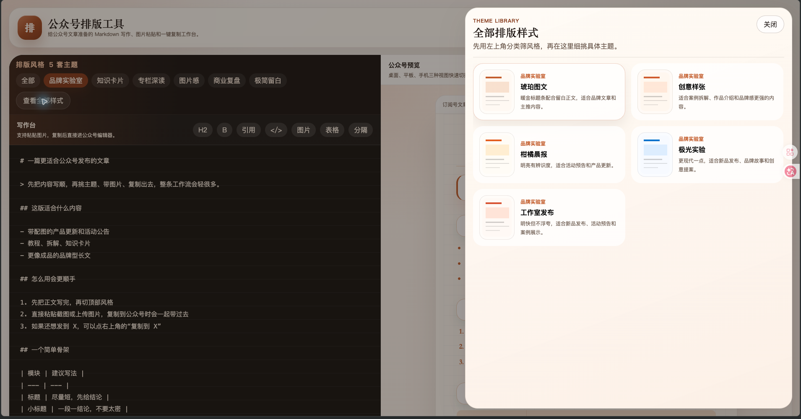
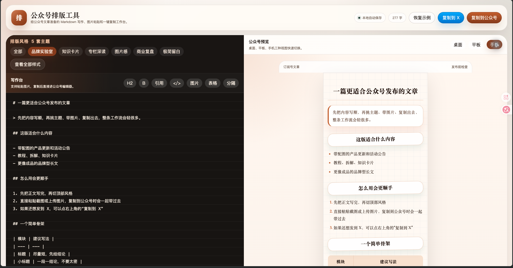

# wxmd

English | [简体中文](./README.zh-CN.md)

wxmd is a lightweight Markdown workspace for WeChat Official Account writers.

It helps authors draft in Markdown, preview articles with polished WeChat-style themes, copy rich HTML into the WeChat editor, and convert the same draft into an X thread. The project is intentionally small: plain HTML, CSS, and JavaScript with no framework, build step, login, or external service dependency.

## What It Does

- Write long-form content in Markdown.
- Preview the article as a WeChat Official Account post.
- Switch between 30 built-in publishing themes.
- Paste or upload images while drafting.
- Copy responsive, inline-styled HTML for the WeChat editor.
- Convert Markdown into X thread copy.
- Autosave the draft, selected theme, and preview mode locally.

## Screenshots

### Markdown editor and WeChat preview



Draft in Markdown on the left and check the WeChat-style article preview on the right.

### Theme library and visual styles



Switch between built-in themes and compare different article visual styles.

### Copy to WeChat and X thread export



Copy rich HTML for the WeChat editor or export the same Markdown draft as an X thread.

## Who It Is For

- WeChat Official Account writers.
- Creators who prefer drafting in Markdown before publishing in WeChat.
- Teams that need quick visual theme switching for articles.
- Writers who repurpose the same article for both WeChat and X.

## Local Development

The project runs with a tiny static server and does not require a bundler.

```bash
npm start
```

Default local URL:

```text
http://127.0.0.1:5173/
```

## Tests

```bash
npm test
```

The test suite uses Node's built-in test runner and covers:

- Markdown rendering
- Editor toolbar actions
- Theme catalog validity
- WeChat clipboard style serialization
- X thread splitting and formatting

## Project Structure

```text
.
├── index.html              # App entry
├── styles.css              # App shell and layout styles
├── scripts/
│   └── static-server.mjs   # Local static server
├── src/
│   ├── app.js              # Main interaction logic
│   ├── editorActions.js    # Editor toolbar actions
│   ├── markdown.js         # Lightweight Markdown renderer
│   ├── themeCatalog.js     # Theme catalog
│   ├── wechatCopy.js       # WeChat copy and inline style export
│   └── xThread.js          # X thread generation
└── tests/                  # Unit tests
```

## WeChat Copy Notes

wxmd does not copy a screenshot of the preview. It converts the rendered article into inline-styled HTML and writes that rich HTML to the clipboard.

The export path focuses on two things:

- preserving theme typography, colors, borders, quote blocks, tables, and other visible styling as much as possible;
- constraining the exported layout for mobile reading so desktop widths are not pasted directly into the WeChat editor.

If the WeChat editor strips a few styles after pasting, that is usually caused by WeChat's own HTML sanitation rules rather than Markdown parsing.

## Technical Notes

- Plain HTML, CSS, and JavaScript
- ESM modules
- No framework and no bundler
- Easy to iterate on article themes and publishing details

## Roadmap

- More themes and theme import support
- Custom theme editor
- Broader Markdown syntax support
- Code highlighting themes
- HTML / PDF export
- Article cover templates

## License

MIT License. See [LICENSE](./LICENSE).
